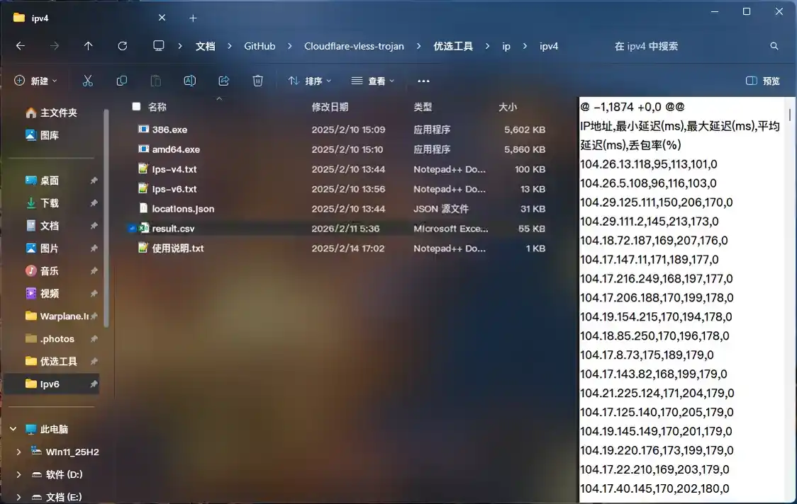
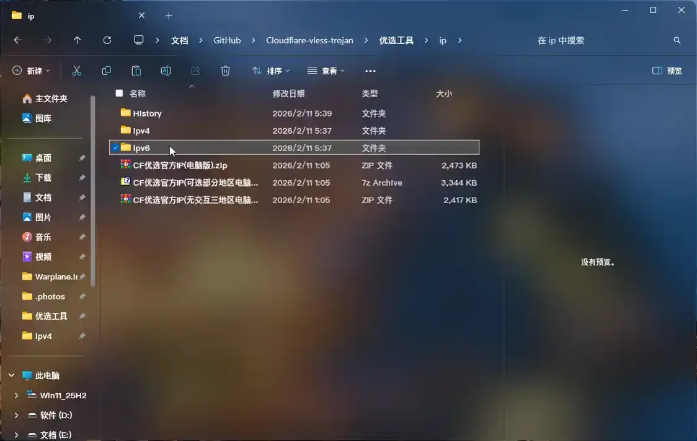
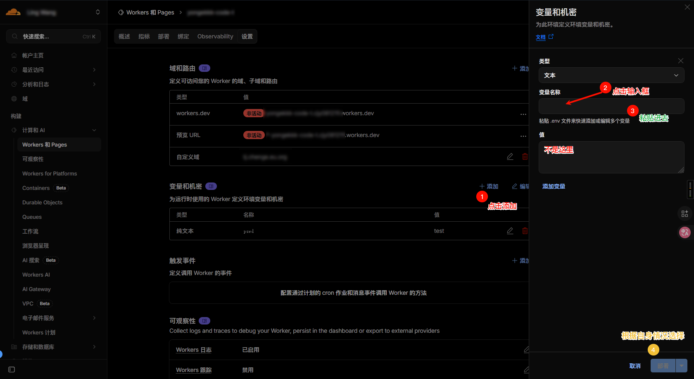

# 关于此python脚本

## 开发原因

### 在优选完后我们需要手动把变量一个个导入到CF_Worker里，翻每个txt,csv优选后结果很麻烦，此脚本可一键导入变量

---

## 使用方法

### 1. 测试结果放入指定文件夹

#### 优选完各文件夹内IP & 域名后，将IP & 域名测试结果复制，在domain & ip路径下打开文件夹History并按照YYYY_MM-DD格式创建今天日期文件夹，把结果复制到里面



##### 💡Tip：IPv6在文件名后面加上_v6后缀



##### 💡Tip2：同时测速v4，v6可以分别复制到对应IPv4 & IPv6文件夹分别打开使用

### 2. 生成变量配置

#### 运行此脚本，他会集合起来自动复制到剪切板并创建相对根目录下worker.env文件存放。


### 3. 一键导入变量

#### 在CF_Worker-变量和机密中，点击添加-点击变量名称下方黑框CTRL+V，你会看到变量批量导入进去，其他变量如果没填完点击保存版本，所有的搞完了可直接部署。




https://github.com/user-attachments/assets/108476a0-e157-48c6-8a0d-3e9d8ef2ef92

---

## 分配策略

- ### 有 IPv6 时：
  
  ### 80系 3 IPv4 + 2 IPv6 + 2 域名
  
  ### 443系采取 2 IPv4 + 2 IPv6 + 2 域名

- ### 无 IPv6 时：
  
  ### 80系 4 IPv4 + 3 域名
  
  ### 443系 3 IPv4 + 3 域名

---

## 目录结构解释

### 注：带*为程序必要条件

```ts
优选工具             //所有工具合集
│  README.md       //说明文档
│  worker.env      //自动生成变量
│  自动生成变量导入cf.py    //主程序
│
├─domain      //域名集
│  │  CDN优选域名V23.8.18(电脑win64).exe     //域名优选工具
│  │
│  └─History  //历史优选数据 *程序要读取最新的必要结构
│      └─2026_02-11  //日期*
│              CDNym.txt  //优选结果_域名*
│
└─ip         //ip集
    │  CF优选官方IP(可选部分地区电脑版).7z     //优选工具——本次使用
    │  CF优选官方IP(无交互三地区电脑版).zip    //优选工具
    │  CF优选官方IP(电脑版).zip              //优选工具
    │
    ├─History   //历史优选数据 *程序要读取最新的必要结构
    │  └─2026_02-11  //日期*
    │          result.csv     //优选结果IPv4*
    │          result_v6.csv  //优选结果IPv6*
    │
    ├─ipv4  //解压到这里可同时运行优选，结果文件复制到History/YYYY_MM-DD/result.csv
    └─ipv6  //解压到这里可同时运行优选，结果文件复制到History/YYYY_MM-DD/result_v6.csv
```

